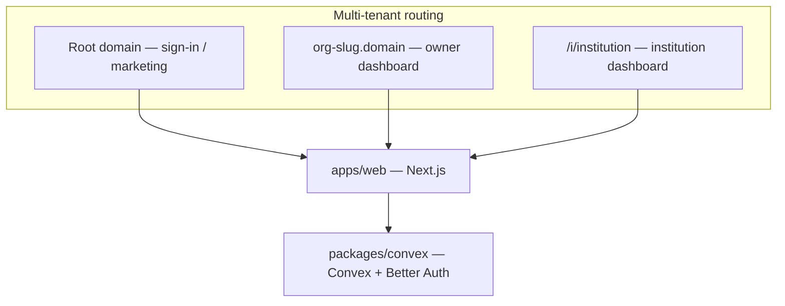

<div style="text-align: center;">
 
</div>

**instello** is a multi-tenant institution management platform. **Owners** register organizations and operate them on dedicated subdomains (`{org-slug}.yourdomain.com`). Each owner can create multiple **institutions** (Better Auth organizations, remapped in code). Within an institution, role-based access supports **principal**, **faculty**, and related workflows — including **programs** and future student/academic features.

**Tech stack:** Bun monorepo (Turborepo), Next.js 16, Convex, Better Auth, shared `@instello/ui` (shadcn-style components), Biome, Vitest.




## Prerequisites

- **Bun** `>= 1.2.2` (package manager)
- **Node.js** `>= 20.20.0`
- **Convex account** (for backend deployment)
- Optional for local subdomains: ability to use `{slug}.localhost:3000` (handled by `apps/web/src/proxy.ts`)

## Setup

1. **Clone and install**
  ```bash
   git clone <repo-url> instello && cd instello
   bun install
  ```
2. **Configure local env files** (copy from examples — see [Environment variables](#environment-variables))
  ```bash
   cp apps/web/.env.local.example apps/web/.env.local
   cp packages/convex/.env.local.example packages/convex/.env.local
  ```
3. **Initialize Convex backend**
  ```bash
   cd packages/convex
   bun run setup   # runs: convex dev --until-success
  ```
   This creates/links a Convex deployment and writes `packages/convex/.env.local`.
4. **Set Convex server environment variables** (once per deployment, from `packages/convex`):
  ```bash
   bun x convex env set BETTER_AUTH_SECRET=$(openssl rand -base64 32)
   bun x convex env set SITE_URL http://localhost:3000
  ```
5. **Sync web env** — copy `CONVEX_URL` and site URL values from `packages/convex/.env.local` into `apps/web/.env.local` as `NEXT_PUBLIC_CONVEX_URL` and `NEXT_PUBLIC_CONVEX_SITE_URL` (`.cloud` vs `.site` suffixes as noted in the example file).
6. **Start development**
  ```bash
   # from repo root
   bun run dev
  ```
   Turbo runs `web` (Next.js on `:3000`) and `@instello/convex` (`convex dev`) in parallel.
7. **Verify** — open `http://localhost:3000`. The sign-in page should show the Instello logo.

## Environment variables

### `apps/web/.env.local` (local Next.js)


| Variable                      | Required | Description                                                                |
| ----------------------------- | -------- | -------------------------------------------------------------------------- |
| `NEXT_PUBLIC_CONVEX_URL`      | Yes      | Convex deployment URL (ends in `.cloud`)                                   |
| `NEXT_PUBLIC_CONVEX_SITE_URL` | Yes      | Convex HTTP actions URL (ends in `.site`)                                  |
| `NEXT_PUBLIC_ROOT_DOMAIN`     | No       | Production root domain for subdomain routing; defaults to `localhost:3000` |


### `packages/convex/.env.local` (Convex CLI — auto-managed)


| Variable            | Description                           |
| ------------------- | ------------------------------------- |
| `CONVEX_DEPLOYMENT` | Deployment identifier (`dev:...`)     |
| `CONVEX_URL`        | Same as `NEXT_PUBLIC_CONVEX_URL`      |
| `CONVEX_SITE_URL`   | Same as `NEXT_PUBLIC_CONVEX_SITE_URL` |


### Convex Dashboard / `convex env set` (server-side runtime)


| Variable             | Required when       | Description                                                                  |
| -------------------- | ------------------- | ---------------------------------------------------------------------------- |
| `BETTER_AUTH_SECRET` | Always              | Auth signing secret                                                          |
| `SITE_URL`           | Always              | Public app URL (e.g. `http://localhost:3000` in dev, production URL in prod) |
| `ADMIN_EMAIL`        | Seeding admin       | Email for super-admin seed (use `+test@resend.dev` pattern in dev)           |
| `SEED_MODE`          | Dev owner seed only | Must be `true`; blocks owner seed in production                              |
| `SEED_PASSWORD`      | Dev owner seed only | Shared password for seeded user accounts                                     |


> **Note:** `SITE_URL` is set via Convex env (dashboard or CLI), not in `apps/web/.env.local`.

## Seeding initial admin and owners

Seed functions live in `packages/convex/functions/seed/users.tsx` and are **internal mutations** — they must never be exposed to the frontend. Remove or disable `SEED_MODE` in production.

### Seed super admin

1. Set in Convex dashboard or CLI (from `packages/convex`):
  ```bash
   bun x convex env set ADMIN_EMAIL "you+test@resend.dev"
  ```
2. Run the seed:
  ```bash
   bun x convex run seed/users:admin
  ```

- Creates a Better Auth user with role `admin`, email verified, **no password** (passwordless admin — suitable for production via dashboard run).
- Idempotent: skips if admin already exists.

### Seed demo owners and organizations (development only)

1. Set Convex env (from `packages/convex`):
  ```bash
   bun x convex env set SEED_MODE true
   bun x convex env set SEED_PASSWORD "your-dev-password"
  ```
2. Run the seed:
  ```bash
   bun x convex run seed/users:owners
  ```

- Seeds two owners (Walter White / Empire Kingpin, Rajamatha / Mahishmathi Samsthanam) with organization records.
- **Guarded:** throws if `SEED_MODE` or `SEED_PASSWORD` is missing; intended for dev only.
- Sign in at `/` with a seeded email and `SEED_PASSWORD`.

## Folder structure

```text
instello/
├── apps/
│   └── web/                          # Next.js 16 frontend
│       ├── public/                   # Static assets (instello.svg)
│       └── src/
│           ├── app/
│           │   ├── (unauth)/         # Public routes (sign-in)
│           │   ├── (auth)/
│           │   │   ├── o/[subdomain]/ # Owner org dashboard (subdomain rewrite)
│           │   │   └── i/[institution]/ # Institution-scoped routes
│           │   └── api/auth/         # Better Auth catch-all route
│           ├── components/           # App-specific UI (auth, sidebars)
│           ├── hooks/
│           └── lib/                  # Utilities (subdomain root domain)
├── packages/
│   ├── convex/                       # Backend (@instello/convex)
│   │   ├── better-auth/              # Auth client, server helpers, provider for web
│   │   └── functions/
│   │       ├── _generated/           # Auto-generated — do not edit
│   │       ├── betterAuth/           # Better Auth Convex component + schema
│   │       ├── helpers/              # Auth guards, custom query/mutation wrappers
│   │       ├── model/                # Domain logic (no auth checks here)
│   │       ├── seed/                 # Internal seed mutations
│   │       ├── tests/                # Vitest + convex-test
│   │       ├── schema.ts             # App tables (programs, etc.)
│   │       ├── programs.ts           # Public API entry points
│   │       └── http.ts               # HTTP routes
│   └── ui/                           # Shared design system (@instello/ui)
│       └── src/components/           # shadcn-style primitives
├── .github/workflows/ci.yml          # Biome, typecheck, backend tests
├── turbo.json
└── biome.json
```


| Path                              | Purpose                                                                 |
| --------------------------------- | ----------------------------------------------------------------------- |
| `apps/web`                        | Next.js frontend — routing, auth UI, and tenant-aware pages             |
| `packages/convex`                 | Convex backend with Better Auth integration                             |
| `packages/convex/better-auth`     | Auth client, server helpers, and React provider exported to the web app |
| `packages/convex/functions`       | Public Convex API — auth checks and access control live here            |
| `packages/convex/functions/model` | Domain business logic and database operations (no auth)                 |
| `packages/convex/functions/seed`  | Internal-only seed mutations for admin and demo data                    |
| `packages/ui`                     | Shared UI components consumed by the web app                            |


## Guidelines

### Architecture

```text
Frontend → functions/ (auth + access control) → model/ (business logic) → Convex DB
```

- Public Convex functions in `functions/` enforce auth via helpers like `ensureSession`, `ensureInstitution` and wrappers in `packages/convex/functions/helpers/customFunctions.ts` (`userQuery`, `insQuery`, etc.).
- `model/` must **not** perform auth, authorization, or access checks. See [packages/convex/functions/model/README.md](packages/convex/functions/model/README.md).

### Roles


| Role          | Description                                              |
| ------------- | -------------------------------------------------------- |
| **admin**     | Global super-admin (Better Auth admin plugin)            |
| **owner**     | Organization owner; manages institutions under their org |
| **principal** | Institution admin                                        |
| **faculty**   | Institution member (read-heavy program access)           |


### Workflow (TDD)

1. Define API contract
2. Write failing tests
3. Implement the feature
4. Make tests pass
5. Refactor if necessary

### Commands


| Command                | Purpose                           |
| ---------------------- | --------------------------------- |
| `bun run dev`          | Start web + Convex                |
| `bun run check`        | Biome lint/format across monorepo |
| `bun run fix`          | Auto-fix Biome issues             |
| `bun run typecheck`    | TypeScript check all packages     |
| `bun run test:backend` | Vitest for Convex functions       |


### Rules of thumb

- Never edit `functions/_generated/` or `betterAuth/_generated/`
- Validate all external input; use Convex validators on every public function
- Keep functions small; prefer shared helpers over duplication
- Write tests for all public Convex functions
- Follow existing patterns before introducing new abstractions
- For Convex-specific work, see [packages/convex/README.md](packages/convex/README.md)

## License

No licence - It's a private repo, it shouldn't be re-used / sell as SASS by other thirdparty. It's complete ownership & copyrights belongs to JB PORTALS ® company. It's truly a private repository.